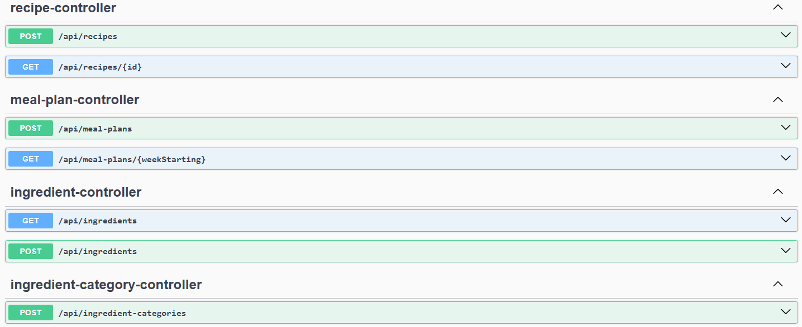

# Edit Eats 🍲🗓️

*Current implementation includes ingredient management, recipe creation with reusable
ingredients and ordered steps, and recipe categorisation. Meal planning and shopping list
generation are currently under development. *


Edit Eats is a backend-focused Java application for recipe management, meal planning and
shopping list generation. It started as a personal project to solve a problem I regularly encountered when 
planning meals and managing recipes. I wanted to build something practical while developing my backend software engineering skills in Java and Spring Boot.

The project gave me an opportunity to apply software engineering concepts to a real-world problem, including designing a relational data model, building RESTful APIs, implementing business logic, handling unit conversions and calculations, validating user input, and writing automated tests.

I continue to develop Edit Eats as a portfolio project, with the longer-term goal of evolving it into a web and mobile application.

[//]: # (A Spring Boot + Java 17 backend for storing recipes, planning meals, and generating a combined shopping list with unit conversions.)

---

## Technology stack

| Technology | Purpose |
|------------|---------|
| Java 17 | Programming language|
| Spring Boot | Backend framework |
| Spring Web | REST API |
| Spring Data JPA | Data access |
| Hibernate | ORM |
| H2 Database | Development database |
| Maven | Dependency management |
| Lombok | Boilerplate reduction |
| Spring Validation | Request validation |
| Springdoc OpenAPI | Swagger documentation |
| JUnit 5 | Unit testing |
| Mockito | Service layer testing |
| OpenAPI/Swagger | API Documentation |
| Git | Version control |

[//]: # (- Spring Web &#40;REST&#41;)

---

## Swagger UI

The application exposes a REST API documented using OpenAPI.



Interactive documentation:

http://localhost:8080/swagger-ui/index.html

---

## Quick Start

```bash
git clone https://github.com/kristenyarbrough/edit-eats.git
cd edit-eats
mvn spring-boot:run
```

Then open:

```
http://localhost:8080/swagger-ui/index.html
```

---

## Why Edit Eats?

Recipe applications often treat ingredients and instructions as simple text. Edit Eats
models recipes using reusable ingredients, ordered preparation steps and categorisation,
making the data suitable for meal planning, shopping list generation and future expansion
into web and mobile applications.

---

## Project Status
🚧 This project is under active development. New features, tests and design improvements
are added regularly as the application evolves.

---

## Features

### Ingredients
- Create and manage ingredients
- Organise ingredients into categories
- Search ingredients by name
- Pagination support

### Recipes
- Create recipes
- Add multiple ingredients to a recipe
- Record ingredient quantities, units and preparation notes
- Mark ingredients as optional
- Add multiple ordered preparation steps
- Assign multiple categories to a recipe
- Store preparation and cooking times
- Record difficulty level
- Store source URLs and recipe images
- Add storage and freezer instructions

### Meal Planning
- Create weekly meal plans
- Generate shopping lists from meal plans
- Automatically combine duplicate ingredients
- Automatic unit conversion when possible
- Shopping list sorted by ingredient category

[//]: # (- OpenAPI / Swagger documentation)

[//]: # (- Validation and error handling)

[//]: # (## What it does)

[//]: # (- **Recipes**)

[//]: # (    - Create, update, delete recipes)

[//]: # (    - Store method, servings, prep/cook times, optional URLs, storage/freezer notes)

[//]: # (    - Store ingredients with quantity + unit)

[//]: # (    - Search recipes by name &#40;case-insensitive&#41;)

[//]: # (    - Pagination on list + search)

[//]: # ()
[//]: # (- **Meal plans**)

[//]: # (    - Create/replace a meal plan for a given week)

[//]: # (    - Generate a **shopping list from a meal plan** &#40;aggregates ingredients across recipes&#41;)

[//]: # ()
[//]: # (- **Unit conversions**)

[//]: # (    - g ↔ kg)

[//]: # (    - ml ↔ l)

[//]: # (    - tsp ↔ tbsp)

[//]: # (    - cup ↔ ml)

[//]: # (    - Shopping list totals are converted + summed correctly)

---

## Architecture

The project follows a layered architecture.

```
            HTTP
              │
              ▼
      RecipeController
              │
              ▼
       RecipeService
       /      |      \
      ▼       ▼       ▼
Ingredient  Step   Category
Repository Repository Repository
      \       |       /
              ▼
             H2
```

### Controller
Handles HTTP requests and responses.

### Service
Contains business logic and validation.

### Repository
Provides database access using Spring Data JPA.

### Domain
Represents the application's persistent entities.

### DTOs
Separate the REST API contract from the persistence model.

---

## Design Decisions

Several design decisions were made to make the application flexible and closer to how recipes are managed in the real world.

- **Recipe names are not unique.**
  Different recipes may legitimately share the same name while having
  different ingredients, methods or serving sizes.
- **Recipe ingredients are stored as a join entity.**
  Rather than a simple many-to-many relationship, RecipeIngredient
  stores additional information including quantity, unit, preparation
  notes and whether the ingredient is optional.
- **Recipe steps are stored as separate ordered records.**
  This makes it easier to edit, reorder and display individual steps.
- **Recipes can belong to multiple categories.**
  For example, a recipe may be both *Breakfast* and *Vegetarian*.
- **Recipe categories and ingredient categories are separate concepts.**
  Ingredient categories are used to organise shopping lists (e.g. Dairy,
  Produce), while recipe categories describe the recipe itself (e.g. Breakfast,
  Dessert, Vegetarian).
- **Ingredients reference reusable master records.**
  Recipes link to shared ingredients rather than storing ingredient names as free text,
  ensuring consistency across recipes.
- **Ingredient quantities use `BigDecimal`.**
  This supports precise measurements such as 0.125 teaspoons or 0.333 cups without
  floating-point rounding issues.
- **Preparation and cooking times are stored separately.**
  This allows the total recipe time to be calculated while preserving more meaningful
  information for users.
- **Transactions are used when creating recipes.**
  Recipes, ingredients, steps and category assignments are created as a single transaction
  so partial recipes cannot be persisted if an error occurs.
- **Database configuration supports future migration.**
  The application uses JPA/Hibernate abstractions to minimise database-specific code,
  allowing the development database to be replaced with PostgreSQL in future.

---

## Database Design

Current entities include:

### Core

- Recipe
- Recipe Ingredient
- Recipe Step
- Recipe Category
- Recipe Category Assignment

### Ingredients

- Ingredient
- Ingredient Category

### Meal Planning

- Meal Plan
- Meal Plan Recipe

Key relationships include:

- Recipe → many Recipe Ingredients
- Recipe → many Recipe Steps
- Recipe → many Recipe Categories
- Ingredient → one Ingredient Category

---

[//]: # (## Entity Relationship Diagram)

[//]: # ()
[//]: # (![Edit Eats ERD]&#40;docs/images/edit-eats-erd.png&#41;)

[//]: # ()
[//]: # (---)

## API
### Ingredients
| Method | Endpoint         |
|--------|------------------|
| POST | /api/ingredients |
| GET | /api/ingredients |
| GET | /api/ingredients/search |

### Recipe Categories
| Method | Endpoint         |
|--------|------------------|
| POST | /api/recipe-categories |
| GET | /api/recipe-categories |

### Recipes
| Method | Endpoint         |
|--------|------------------|
| POST | /api/recipes |
| GET | /api/recipes |

---

## Example Request

### Create Recipe

```http
POST /api/recipes
```

```json
{
  "name": "Scrambled Eggs",
  "prepMinutes": 2,
  "cookMinutes": 5,
  "servings": 2,
  "difficulty": "EASY",
  "storageInstructions": "Keep refrigerated for up to 2 days.",
  "freezerInstructions": "Not suitable for freezing.",
  "ingredients": [
    {
      "ingredientId": 1,
      "quantity": 4,
      "unit": "EACH",
      "optional": false
    },
    {
      "ingredientId": 2,
      "quantity": 30,
      "unit": "ML",
      "optional": false
    }
  ],
  "steps": [
    {
      "instruction": "Crack the eggs into a bowl."
    },
    {
      "instruction": "Whisk until smooth."
    },
    {
      "instruction": "Cook gently in a pan while stirring."
    }
  ],
  "categories": [
    {
      "recipeCategoryId": 1
    }
  ]
}
```

---

## Running the Project

### Prerequisites

- Java 17
- Maven

### Clone

```bash
git clone https://github.com/kristenyarbrough/edit-eats.git
```

### Run

```bash
mvn spring-boot:run
```

The application starts on:

```
http://localhost:8080
```

---

## Testing

The project uses:

- JUnit 5
- Mockito

Current unit tests verify:

- Successful recipe creation
- Validation of referenced entities
- Business rule enforcement
- Exception handling
- Repository interactions using Mockito

---

## Roadmap

Planned improvements include:

### In Progress
- Update recipes
- Delete recipes
- Recipe search
- Pagination for recipes
- Recipe scaling

### Planned
- Meal planning calendar
- Shopping list improvements
- Nutritional information
- PostgreSQL support
- Flyway database migrations

### Future ideas
- Docker support
- CI/CD pipeline
- User accounts
- Authentication
- Frontend web application
- Mobile application

---

## Technical Highlights

This project demonstrates:

- Layered architecture
- RESTful API design
- DTO mapping
- Spring Data JPA
- Entity relationships
- Transaction management
- Request validation
- Exception handling
- Unit testing with JUnit 5 and Mockito
- Clean code principles

---

## Author

Kristen Yarbrough

GitHub:
https://github.com/kristenyarbrough

Edit Eats:
https://github.com/kristenyarbrough/edit-eats

---


[//]: # ()
[//]: # (## Planned Features)

[//]: # ()
[//]: # (- Meal planning calendar)

[//]: # (- Shopping list generation)

[//]: # (- Recipe search and filtering)

[//]: # (- User accounts)

[//]: # (- Recipe images)

[//]: # (- Nutrition information)

[//]: # (- Recipe scaling)

[//]: # (- PostgreSQL support)

[//]: # (- Flyway database migrations)

[//]: # ()
